# Jambo Passkey Claims

A Next.js application for blockchain-based claims management with passkey (WebAuthn) authentication, Yoma SSO integration, and encrypted Matrix Data Vault storage on the ixo blockchain.

## Table of Contents

- [Overview](#overview)
- [Getting Started](#getting-started)
- [Architecture](#architecture)
- [Authentication Flows](#authentication-flows)
  - [SSO Flow (Yoma Keycloak)](#sso-flow-yoma-keycloak)
  - [Passkey Registration](#passkey-registration)
  - [Passkey Login](#passkey-login)
  - [Mnemonic Login (Recovery)](#mnemonic-login-recovery)
- [Matrix Data Vault](#matrix-data-vault)
- [Two-Tier Encrypted Vault](#two-tier-encrypted-vault)
- [Background Setup and Resilience](#background-setup-and-resilience)
- [Blockchain Integration](#blockchain-integration)
- [Transaction Signing](#transaction-signing)
- [Dashboard](#dashboard)
- [Bids](#bids)
- [Claims](#claims)
- [Project Structure](#project-structure)
- [SDKs Used](#sdks-used)
- [Environment Variables](#environment-variables)

---

## Overview

Jambo Passkey Claims enables users to submit verifiable claims on the ixo blockchain using passkeys for authentication and transaction signing. The system integrates:

- **Yoma SSO** (Keycloak OIDC) for identity verification
- **WebAuthn/Passkeys** for passwordless authentication and on-chain transaction signing
- **Matrix Protocol** as an encrypted "Data Vault" for mnemonic storage and recovery
- **ixo Blockchain** for DID management, fee grants, and claim submission
- **Veramo** for W3C Verifiable Credential issuance
- **Matrix Bots** (Bid Bot, Claim Bot, Room Bot) for off-chain data management

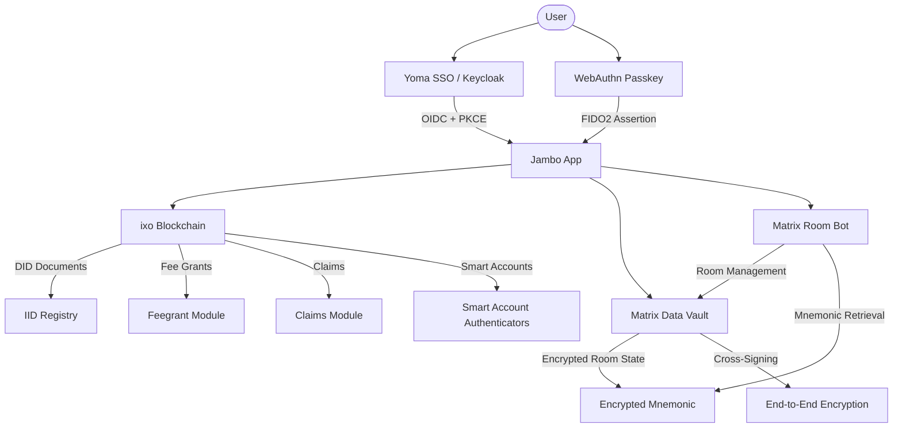

---

## Getting Started

### Prerequisites

- Node.js 16+
- yarn

### Installation

```bash
git clone https://github.com/ixofoundation/jambo-claims.git
cd jambo-claims
yarn install
```

### Configuration

1. Create a `.env` file in the root directory based on `.env.example`
2. Add the required environment variables (see [Environment Variables](#environment-variables))
3. Update `constants/config.json` with your entity and protocol DIDs

### Development

```bash
yarn dev
```

The application will be available at `http://localhost:3000`.

### Build

```bash
yarn build
yarn start
```

---

## Architecture

### High-Level Flow

The application uses a hybrid authentication model where SSO provides identity, passkeys provide cryptographic authentication, and Matrix provides encrypted persistent storage:

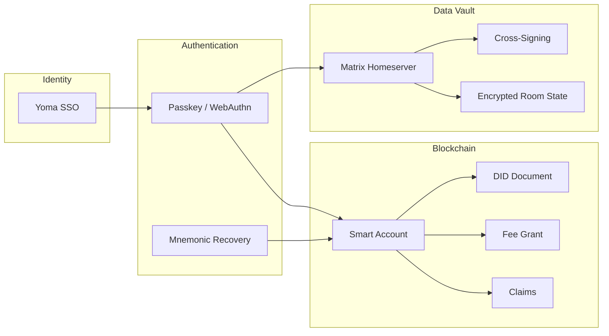

### Key Concepts

| Concept | Description |
|---------|-------------|
| **Passkeys (WebAuthn)** | Cryptographic credentials linked to biometric sensors. Replace passwords with passwordless login. Registered on-chain as smart account authenticators. |
| **DID (IID Document)** | Decentralized identity document stored on-chain following the W3C DID standard. Format: `did:ixo:{address}`. |
| **Fee Grants** | Allow a third party to pay blockchain gas fees on behalf of users, enabling gasless interactions. |
| **Matrix Data Vault** | Matrix rooms used as encrypted storage containers for mnemonics, claim data, and keys. |
| **Matrix Mnemonic** | A separate 12-word seed phrase used to derive Matrix credentials. Not the same as the wallet mnemonic. |
| **Cross-Signing** | Enables trust across Matrix devices so encrypted data can be accessed from multiple sessions. |
| **Matrix Bots** | Room Bot (room management), Bid Bot (off-chain bid storage), Claim Bot (encrypted claim data storage). |

---

## Authentication Flows

All authentication begins with Yoma SSO, then proceeds to passkey registration or login.

### SSO Flow (Yoma Keycloak)

The user signs in via Yoma Keycloak OIDC with PKCE protection. The app extracts their profile (name, email, picture) for use in passkey and Matrix profile setup.

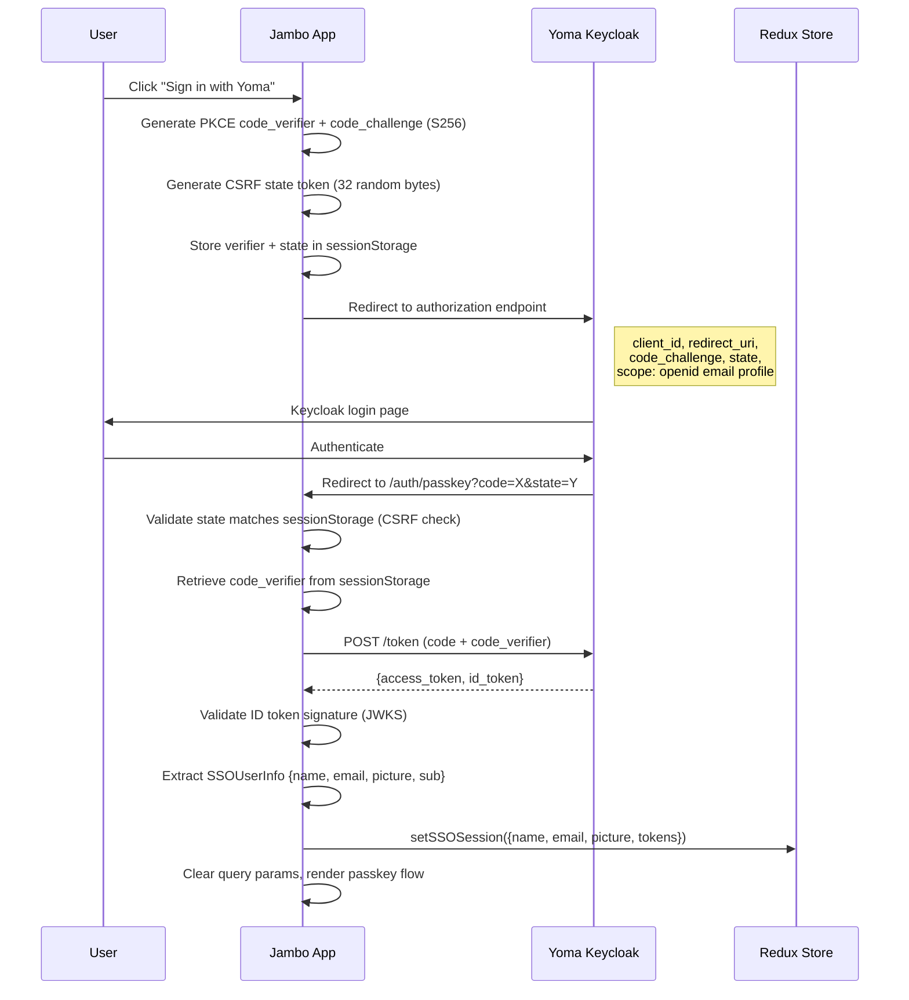

**Key details:**
- PKCE S256 prevents authorization code interception
- ID token validated against Keycloak JWKS endpoint using the `jose` library
- SSO profile stored in Redux for passkey display name and Matrix profile
- Redirect URI is `/auth/passkey` (handles both SSO callback and passkey flow)
- Legacy `/auth/callback` route redirects to `/auth/passkey` preserving query params
- Display name fallback: SSO name, then email if name is absent

**Key files:** `lib/sso/redirect.ts`, `lib/sso/pkce.ts`, `lib/sso/tokens.ts`, `lib/sso/config.ts`, `pages/auth/passkey.tsx`

---

### Passkey Registration

Registration is split into a **blocking phase** (user-facing, must complete before app entry) and a **background phase** (runs asynchronously after the user enters the app).

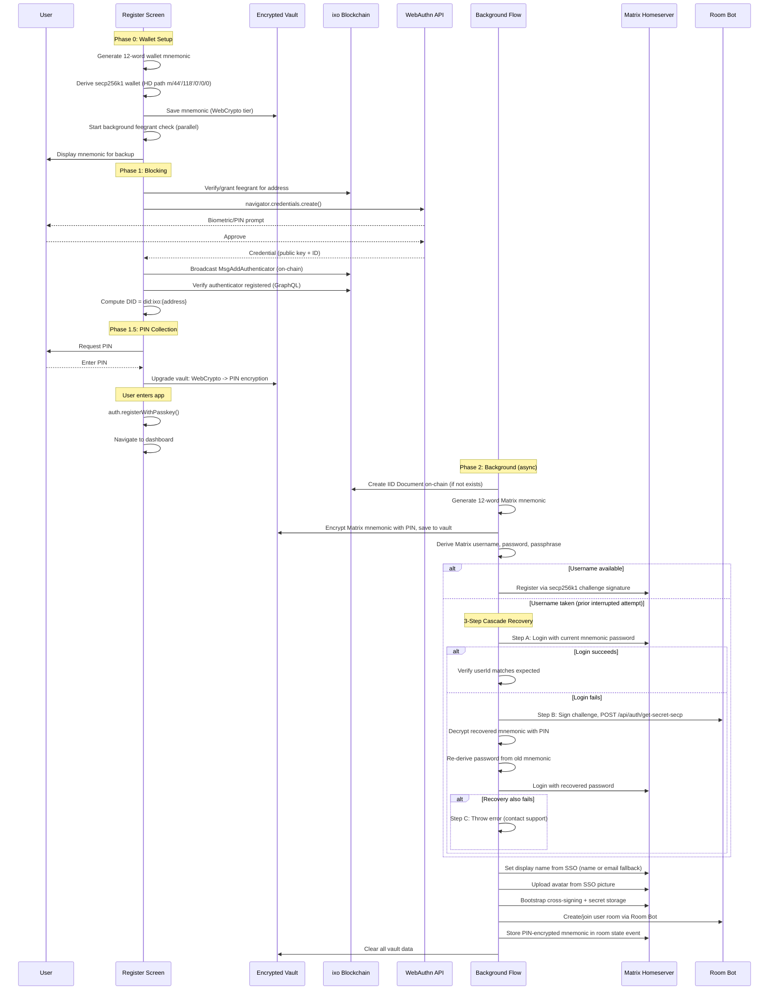

#### Registration Step Order (Redux)

The setup flow is tracked in Redux for resilience. Each step represents a checkpoint that can be resumed from:

| # | Step | Description |
|---|------|-------------|
| 1 | `MNEMONIC_SAVED` | Wallet mnemonic saved to vault (WebCrypto tier) |
| 2 | `FEEGRANT_GRANTED` | Fee grant verified/granted on-chain |
| 3 | `PASSKEY_REGISTERED` | WebAuthn credential created and verified on-chain |
| 4 | `PIN_COLLECTED` | User provided PIN, vault upgraded to PIN tier |
| 5 | `DID_CREATED` | IID document created on-chain |
| 6 | `MATRIX_MNEMONIC_SAVED` | Matrix mnemonic encrypted with PIN, saved to vault |
| 7 | `MATRIX_ACCOUNT_CREATED` | Matrix account registered or recovered via cascade |
| 8 | `CROSS_SIGNING_DONE` | Cross-signing and secret storage bootstrapped |
| 9 | `MATRIX_ROOM_CREATED` | User room created/joined via Room Bot |
| 10 | `MNEMONIC_STORED_IN_ROOM` | Encrypted mnemonic stored in Matrix room state |
| 11 | `COMPLETE` | Vault cleared, setup finished |

#### Matrix Account Recovery Cascade

When registration is interrupted after a Matrix account was created but before the flow completed, a subsequent attempt finds the username already taken. The system uses a 3-step cascade to recover gracefully:

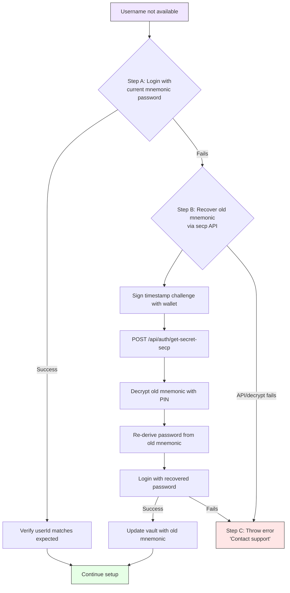

**Key files:** `lib/auth/passkeyFlow.ts` (`passkeyRegisterBlocking`, `registerBackground`), `screens/registerPasskey.tsx`, `lib/authn/register.ts`

---

### Passkey Login

Login uses blocking + background phases, with an address selection step when multiple addresses are associated with a single passkey credential.

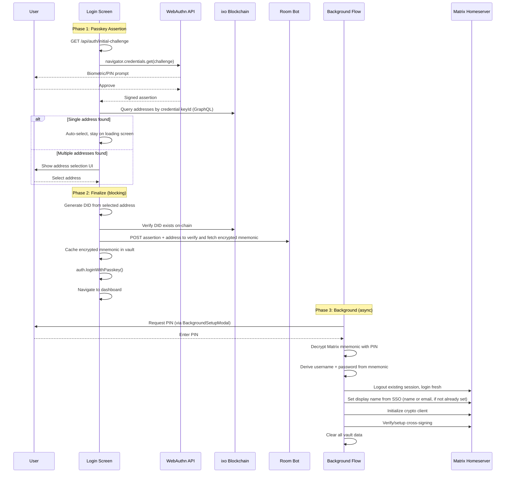

#### Login Step Order (Redux)

| # | Step | Description |
|---|------|-------------|
| 1 | `PASSKEY_ASSERTED` | WebAuthn assertion obtained, addresses queried |
| 2 | `ENCRYPTED_MNEMONIC_CACHED` | Encrypted mnemonic fetched from bot, cached in vault |
| 3 | `PIN_ENTERED` | User provided PIN, mnemonic decrypted |
| 4 | `MATRIX_LOGGED_IN` | Logged in to Matrix homeserver |
| 5 | `CROSS_SIGNING_DONE` | Cross-signing verified/setup |
| 6 | `COMPLETE` | Vault cleared, login finished |

**Key files:** `lib/auth/passkeyFlow.ts` (`passkeyLoginBlocking`, `passkeyLoginBlockingFinalize`, `matrixLoginBackground`), `screens/loginPasskey.tsx`

---

### Mnemonic Login (Recovery)

An alternative login path using a 12-word mnemonic for account recovery or direct access. Uses secp256k1 wallet signing instead of passkey assertion to authenticate with the Matrix Room Bot.

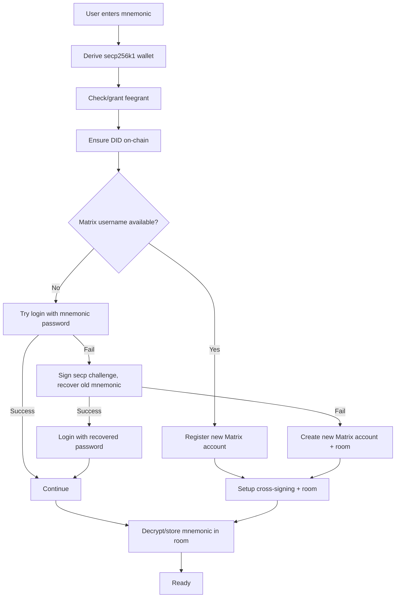

**Key file:** `screens/loginMnemonic.tsx`

---

## Matrix Data Vault

Matrix is used as a decentralized, encrypted "Data Vault" for persistent storage of sensitive credentials. This allows mnemonic recovery across devices using only a passkey assertion + PIN.

### Storage Architecture

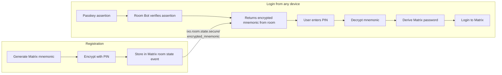

### Credential Derivation

All Matrix credentials are deterministically derived from the Matrix mnemonic:

| Credential | Derivation | Purpose |
|-----------|-----------|---------|
| **Username** | `'did-ixo-' + blockchain_address` | Account identifier |
| **Password** | `base64(MD5(mnemonic)).slice(0, 24)` | Login authentication |
| **Passphrase** | `base64(SHA256(mnemonic)).slice(0, 32)` | Cross-signing recovery key |
| **Room Alias** | `#did-ixo-{address}:{homeserver}` | Personal room identifier |

### Account Creation

New Matrix accounts are created via the Room Bot using a secp256k1 challenge-response:

1. Client creates a challenge: `{timestamp, address, service: 'matrix', type: 'create-account'}`
2. Client signs challenge with secp256k1 wallet
3. Password encrypted with ECIES using the bot's public key
4. Bot verifies signature and creates the Matrix account

### Cross-Signing and E2E Encryption

After account creation/login, the app:

1. Derives a recovery key from the mnemonic passphrase
2. Bootstraps Matrix secret storage with the recovery key
3. Bootstraps cross-signing with password authentication
4. Resets key backup

This ensures encrypted room state is accessible across sessions and devices.

**Key files:** `utils/matrix.ts`, `utils/signingMnemonic.ts`, `utils/secretStorageKeys.ts`

---

## Two-Tier Encrypted Vault

A browser-based encrypted vault survives interruptions during registration/login. It uses two encryption tiers depending on whether the user has entered their PIN yet.

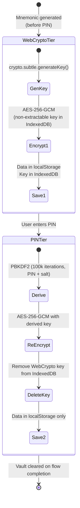

### Tier Comparison

| Property | Tier 1: WebCrypto | Tier 2: PIN |
|----------|-------------------|-------------|
| **When used** | Before PIN collected | After PIN collected |
| **Encryption key** | Non-extractable AES-256-GCM in IndexedDB | PBKDF2-derived AES-256-GCM from PIN |
| **Key storage** | IndexedDB (non-extractable) | Derived on-the-fly from PIN |
| **Data storage** | localStorage | localStorage |
| **Data format** | `iv_hex:ciphertext_hex` | `salt_hex:iv_hex:ciphertext_hex` |

### Vault Slots

| Slot | Content | Lifecycle |
|------|---------|-----------|
| `wallet` | Blockchain signing mnemonic (secp256k1 wallet) | Saved at registration start, cleared on completion |
| `matrix` | Matrix account mnemonic (for password/passphrase derivation) | Saved during background setup, cleared on completion |

### Crash Recovery

The vault tracks its tier state (`webcrypto`, `upgrading`, `pin`). If a crash occurs during the tier upgrade:

1. Tier is marked as `'upgrading'` before starting
2. On resume, tries PIN decryption first
3. Falls back to WebCrypto decryption for slots that weren't yet upgraded
4. Completes the upgrade

**Key file:** `utils/setupVault.ts`

---

## Background Setup and Resilience

### Background Setup Provider

After the blocking phase completes and the user enters the app, Matrix setup runs asynchronously via the `BackgroundSetupProvider`. This keeps the app responsive while long-running operations happen in the background.

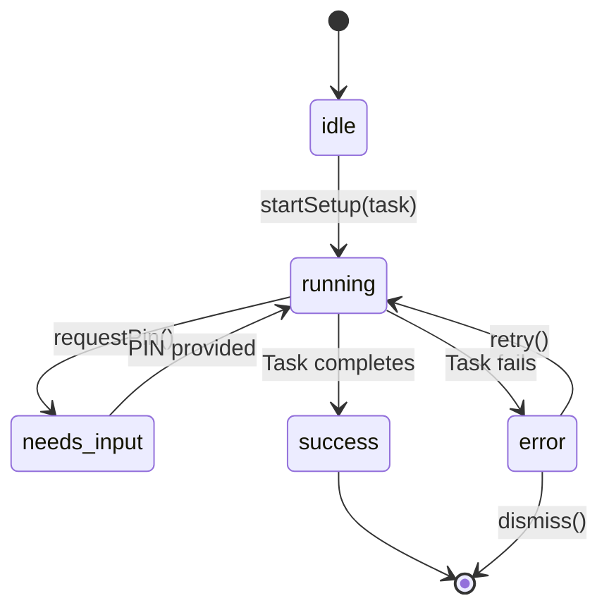

The `BackgroundSetupModal` component shows progress status messages and a PIN input form when needed. The `HeaderStatusIndicator` shows setup status in the app header.

### Flow Resume on Page Reload

If the page reloads during setup, the `SetupResumeProvider` detects incomplete flows via Redux persisted state and vault data:

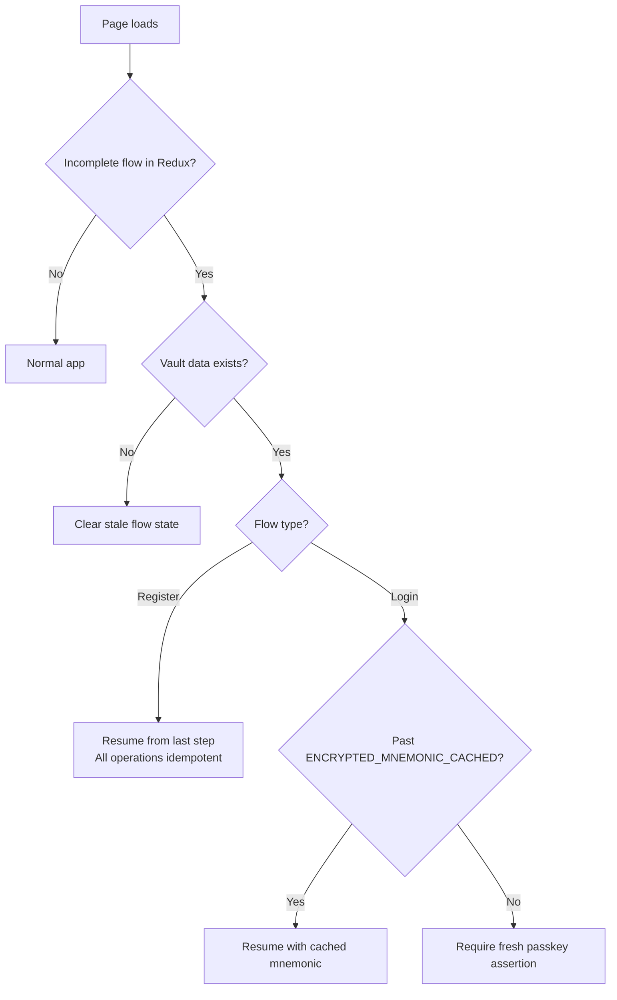

**Registration resume**: Loads wallet mnemonic from vault, skips completed steps using `REGISTER_STEP_ORDER` index comparison. All operations check existence before creating (idempotent).

**Login resume**: If encrypted mnemonic is cached in vault, resumes from PIN collection. If not yet cached, requires a fresh passkey assertion (`PASSKEY_REDO_NEEDED`).

**Key files:** `providers/backgroundSetup.tsx`, `providers/setupResume.tsx`, `store/slices/setupFlowSlice.ts`

---

## Blockchain Integration

### DID Management

Each user gets a decentralized identifier (DID) on the ixo blockchain:

- **Format**: `did:ixo:{address}` (deterministic from secp256k1 address)
- **IID Document**: Created on-chain with `MsgCreateIidDocument`
- **Verification Methods**: secp256k1 key for authentication
- **Ed25519**: Optional verification method added for credential signing (via Veramo)

### Fee Grants

Users don't need native tokens to transact. The feegrant module provides transaction fee delegation:

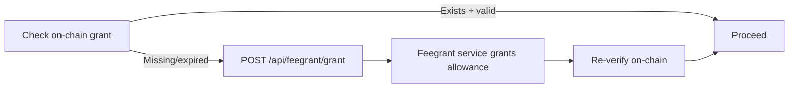

During registration, the feegrant check is started in the background as soon as the wallet is created (parallel with mnemonic display), so it's likely ready by the time the user clicks Continue.

### Smart Account Authenticators

Passkeys are registered on-chain as smart account authenticators:

1. WebAuthn credential created with ES256 or RS256
2. Public key extracted and encoded as `AuthnPubKey` protobuf
3. `MsgAddAuthenticator` broadcast with credential data
4. Verified via BlockSync GraphQL query for the credential ID

**Key files:** `utils/did.ts`, `utils/feegrant.ts`, `lib/authn/register.ts`

---

## Transaction Signing

The app supports two signing methods:

### Passkey Signing

Used for all transactions after registration (claims, authz grants, etc.):

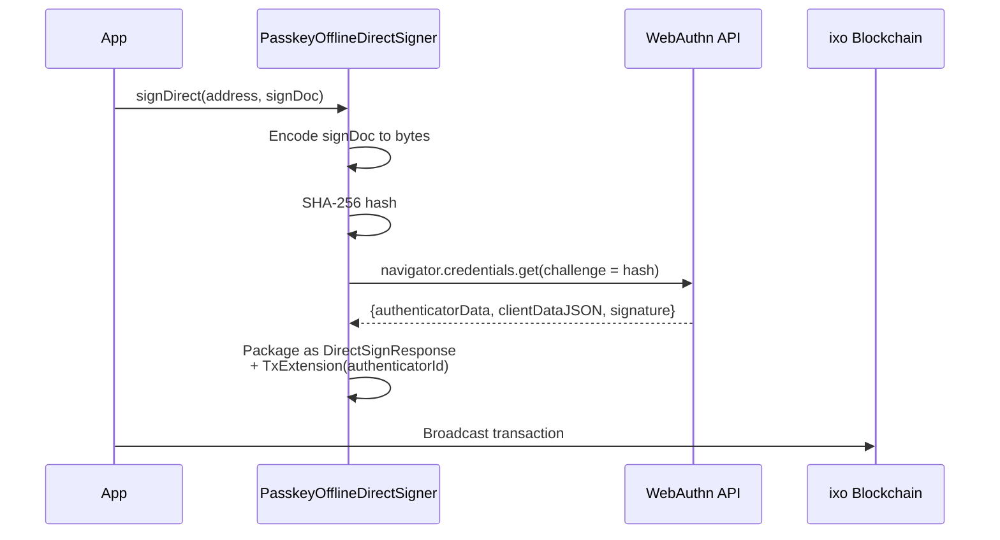

The `PasskeyOfflineDirectSigner` implements the Cosmos `OfflineDirectSigner` interface, enabling standard Cosmos transaction signing via passkey.

### Mnemonic Signing

Standard Cosmos signing using the secp256k1 wallet derived from the user's mnemonic. Used during registration for on-chain operations (DID creation, authenticator registration) and as the mnemonic login signing method.

- Gas estimation via simulation with 1.7x multiplier
- Fee calculation from chain gas step prices
- Feegrant granter address included when applicable

**Key files:** `lib/authn/signAndBroadcast.ts`, `lib/authn/PasskeyOfflineDirectSigner.ts`, `utils/transaction.ts`

---

## Dashboard

Once logged in, users land on the **Dashboard**, which displays available **Claim Collections** for the configured entity.

The dashboard checks the user's authorization status for each collection using:
- The collection admin field
- Protocol entity ownership
- Blockchain authz module grant data

### Roles

| Role | Description |
|------|-------------|
| `Collection Admin` | Full control over the collection |
| `Collection Owner` | Owner of the protocol entity |
| `Service Agent` | Authorized to submit claims (SubmitClaimAuthorization) |
| `Evaluation Agent` | Authorized to evaluate claims (EvaluateClaimAuthorization) |

### Tabs

| Tab | Description | Required Role(s) |
|-----|-------------|------------------|
| **My Bids** | View and manage bids submitted by the current user | Any logged-in user |
| **Collection Bids** | View all bids submitted to the collection | Admin, Owner |
| **My Claims** | View and manage claims submitted by the user | Service Agent |
| **Collection Claims** | View all claims submitted to the collection | Admin, Owner, Evaluation Agent |

---

## Bids

The Bids section is managed entirely by the **Matrix Bid Bot**. All bids are stored and managed in Matrix, not on-chain.

### How it Works

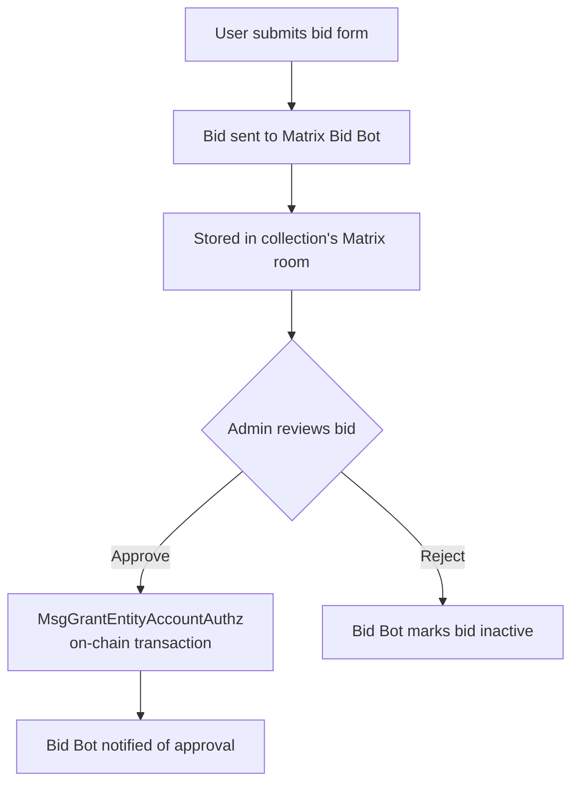

1. Users submit bids through a **SurveyJS** form rendered from the collection's protocol
2. The bid is sent to the **Matrix Bid Bot**, which validates and stores it
3. No blockchain transaction occurs at submission — the bid exists entirely off-chain
4. When an admin approves a bid:
   - An `MsgGrantEntityAccountAuthz` transaction grants the bidder a role (Service Agent or Evaluation Agent)
   - The Bid Bot is notified and marks the bid as accepted

### My Bids

Any logged-in user can:
- View their existing bids
- Submit a new bid as a Service Agent (SA) or Evaluation Agent (EA)
- Only one active bid per user per collection

### Collection Bids

Admins and owners can:
- View all bids submitted to the collection
- Approve bids (triggers on-chain authz grant)
- Reject bids with an optional reason

---

## Claims

Claims are recorded **on-chain** through blockchain transactions, but the associated data (survey responses) is stored privately in the collection's **Matrix room** via the **Matrix Claim Bot**.

### How it Works

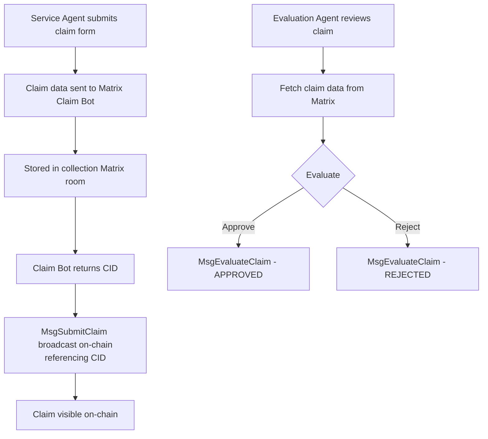

1. A Service Agent completes a **SurveyJS** form
2. Claim data is encrypted and stored in the Matrix room via the **Claim Bot**, which returns a CID
3. A `MsgSubmitClaim` transaction is broadcast on-chain, linking the CID
4. Evaluation Agents can fetch and decrypt the claim data from Matrix
5. Evaluation triggers a `MsgEvaluateClaim` transaction on-chain

### Credential Signing

Claims are signed as W3C Verifiable Credentials using **Veramo**:
- Ed25519 key pair derived from user's mnemonic
- `VerifiableCredential` with type `ClaimCredential`
- Signed with `Ed25519VerificationKey2018` proof

---

## Project Structure

```
jambo-passkey-claims/
├── pages/
│   ├── auth/
│   │   ├── index.tsx              # Auth landing (SSO redirect button)
│   │   ├── passkey.tsx            # SSO callback handler + passkey login
│   │   ├── register.tsx           # Passkey registration entry
│   │   └── callback.tsx           # Legacy SSO redirect
│   ├── api/
│   │   ├── auth/
│   │   │   ├── initial-challenge.ts   # FIDO2 challenge generation
│   │   │   ├── get-secret.ts          # Passkey-based mnemonic retrieval
│   │   │   └── get-secret-secp.ts     # Secp-based mnemonic retrieval (recovery)
│   │   ├── matrix/
│   │   │   ├── create-user.ts         # Matrix account creation proxy
│   │   │   └── public-key.ts          # Bot encryption public key
│   │   └── feegrant/
│   │       └── grant.ts               # Fee grant request proxy
│   ├── entities/[entityId]/
│   │   ├── index.tsx                  # Dashboard
│   │   └── claimCollections/
│   │       └── [collectionId].tsx     # Claim submission UI
│   ├── index.tsx                  # Homepage (auth redirect)
│   └── profile.tsx                # User profile
│
├── screens/                       # Main screen components
│   ├── registerPasskey.tsx        # Registration UI orchestration
│   ├── loginPasskey.tsx           # Login UI orchestration
│   ├── loginMnemonic.tsx          # Mnemonic login (recovery)
│   ├── loginSignX.tsx             # SignX login
│   ├── loginMethodSelector.tsx    # Login method selection
│   ├── dashboard.tsx              # Collection dashboard
│   ├── collectionDetail.tsx       # Claim/bid submission UI
│   └── profile.tsx                # Profile screen
│
├── lib/
│   ├── auth/
│   │   └── passkeyFlow.ts        # Core flow orchestration (register + login)
│   ├── authn/                     # WebAuthn/FIDO2 implementation
│   │   ├── client.ts             # FIDO2 server initialization
│   │   ├── register.ts           # Passkey credential creation
│   │   ├── login.ts              # Passkey assertion verification
│   │   ├── signAndBroadcast.ts   # Passkey transaction signing
│   │   └── PasskeyOfflineDirectSigner.ts  # Cosmos signer interface
│   └── sso/                       # Yoma SSO / OIDC
│       ├── config.ts             # Keycloak configuration
│       ├── pkce.ts               # PKCE challenge generation
│       ├── redirect.ts           # Authorization redirect
│       └── tokens.ts             # Token exchange + JWT validation
│
├── components/                    # Reusable UI components
│   ├── AuthGuard.tsx             # Protected route wrapper
│   ├── GuestGuard.tsx            # Auth route wrapper (redirect if logged in)
│   ├── BackgroundSetupModal/     # Background task progress + PIN input
│   ├── MatrixPinForm/            # PIN entry form
│   ├── SecretPhraseStep/         # Mnemonic display/confirm
│   ├── Header/                   # Main navigation
│   ├── HeaderStatusIndicator/    # Background setup status in header
│   └── ...                       # Button, Loader, Modal, Toast, etc.
│
├── store/                         # Redux state management
│   ├── slices/
│   │   ├── accountSlice.ts       # Account (address, DID, signing method)
│   │   ├── setupFlowSlice.ts     # Setup progress tracking + step ordering
│   │   ├── ssoSlice.ts           # SSO session (tokens, profile)
│   │   ├── matrixProfileSlice.ts # Matrix display name, avatar
│   │   ├── collectionsSlice.ts   # Claim collections
│   │   ├── entitiesSlice.ts      # Entity data
│   │   └── ...                   # protocols, profiles, claimDrafts
│   └── thunks/
│       └── dataThunks.ts         # Async data fetching
│
├── utils/                         # Core utilities
│   ├── setupVault.ts             # Two-tier encrypted vault (WebCrypto + PIN)
│   ├── encryption.ts             # AES-256-CBC encrypt/decrypt
│   ├── matrix.ts                 # Matrix client, login, register, cross-signing
│   ├── signingMnemonic.ts        # Matrix room mnemonic storage/retrieval
│   ├── secp.ts                   # Secp256k1 wallet client (BIP39 + SLIP-10)
│   ├── did.ts                    # DID creation and management
│   ├── feegrant.ts               # Fee grant check/request
│   ├── claims.ts                 # Claim submission logic
│   ├── transaction.ts            # Transaction building + broadcasting
│   ├── veramo.ts                 # Veramo agent + credential signing
│   ├── url.ts                    # URL sanitization (cleanUrlString)
│   ├── secrets.ts                # Secure credential storage (AES localStorage)
│   ├── secretStorageKeys.ts      # Matrix secret storage key cache
│   └── ...                       # encoding, graphql, storage, etc.
│
├── providers/                     # React context providers
│   ├── auth.tsx                  # Auth context (login state, credentials)
│   ├── theme.tsx                 # Theme provider (light/dark mode)
│   ├── backgroundSetup.tsx       # Background task manager + modal
│   └── setupResume.tsx           # Flow resume on page reload
│
├── hooks/                         # Custom React hooks
│   ├── useAuth.ts                # Auth context access
│   ├── useBackgroundSetup.ts     # Background setup control
│   └── ...                       # useProtocolCollections, useSteps
│
├── constants/                     # Configuration
│   ├── config.json               # Site config (entity DID, protocol DIDs)
│   ├── common.ts                 # Chain networks, RPC URLs, chain IDs
│   ├── auth.ts                   # Secure storage key names
│   └── matrix.ts                 # Matrix constants
│
└── styles/
    ├── variables.scss            # CSS variables (light/dark themes)
    └── globals.scss              # Global styles
```

---

## SDKs Used

| SDK | Description | Link |
|-----|-------------|------|
| [`@ixo/impactxclient-sdk`](https://www.npmjs.com/package/@ixo/impactxclient-sdk) | TypeScript SDK for interacting with the IXO blockchain. Includes transaction building, DID creation, signing, and Cosmos-based features. | [Docs](https://docs.ixo.world/sdk/impactxclient) |
| [`@ixo/matrixclient-sdk`](https://www.npmjs.com/package/@ixo/matrixclient-sdk) | Lightweight wrapper for interacting with IXO Matrix Bots (Claim Bot, Bid Bot, Room Bot). | [GitHub](https://github.com/ixofoundation/ixo-matrixclient-sdk) |
| [`matrix-js-sdk`](https://www.npmjs.com/package/matrix-js-sdk) | Official Matrix client library for registration, login, and homeserver interaction. | [Docs](https://matrix-org.github.io/matrix-js-sdk/) |
| [`fido2-lib`](https://www.npmjs.com/package/fido2-lib) | FIDO2/WebAuthn server-side library for challenge generation and attestation/assertion verification. | [npm](https://www.npmjs.com/package/fido2-lib) |
| [`jose`](https://www.npmjs.com/package/jose) | JWT/JWS/JWE library used for OIDC ID token validation against Keycloak JWKS. | [GitHub](https://github.com/panva/jose) |
| [`@veramo/*`](https://veramo.io/) | DID and Verifiable Credential framework for Ed25519 credential signing. | [Docs](https://veramo.io/docs/basics/introduction) |
| [`@cosmjs/*`](https://github.com/cosmos/cosmjs) | Cosmos SDK client libraries for transaction signing, encoding, and RPC interaction. | [GitHub](https://github.com/cosmos/cosmjs) |

---

## Environment Variables

```env
# Application origin (WebAuthn relying party)
NEXT_PUBLIC_AUTHN_ORIGIN=http://localhost:3000
NEXT_PUBLIC_AUTHN_RP_ID=localhost

# Blockchain network (devnet | testnet | mainnet)
NEXT_PUBLIC_CHAIN_NETWORK=devnet

# Service URLs
NEXT_PUBLIC_FEEGRANT_URL=""
FEEGRANT_API_KEY=""
NEXT_PUBLIC_MATRIX_HOMESERVER_URL=""
NEXT_PUBLIC_MATRIX_ROOM_BOT_URL=""
NEXT_PUBLIC_MATRIX_BID_BOT_URL=""
NEXT_PUBLIC_MATRIX_CLAIM_BOT_URL=""

# Yoma SSO (OIDC / Keycloak)
NEXT_PUBLIC_YOMA_SSO_ISSUER=https://stage.yoma.world/auth/realms/yoma
NEXT_PUBLIC_YOMA_SSO_CLIENT_ID=<client_id>
NEXT_PUBLIC_YOMA_SSO_REDIRECT_URI=http://localhost:3000/auth/passkey
NEXT_PUBLIC_YOMA_SSO_SCOPES=openid email profile
```

---

## License

MIT
